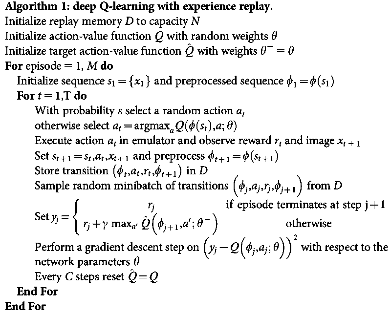

# cartpole
A collection of deep reinforcement learning algorithms implemented in Pytorch and gym to solve the cart-pole problem which has continuous state space but discrete actions.

## Problem definition
From [gym.openai.com](https://gym.openai.com/envs/CartPole-v0/)
> A pole is attached by an un-actuated joint to a cart, which moves along a frictionless track. The system is controlled by applying a force of +1 or -1 to the cart. The pendulum starts upright, and the goal is to prevent it from falling over. A reward of +1 is provided for every timestep that the pole remains upright. The episode ends when the pole is more than 15 degrees from vertical, or the cart moves more than 2.4 units from the center.

A state or observation consists of 4 continuous variants: Cart Position, Cart Velocity, Pole Angle, Pole Velocity At Tip.
There are 2 discrete actions: 0: Push cart to the left, 1: Push cart to the right.
The difference between v0 and v1 is that the max episode steps for v0 and v1 is 200 and 500 respectively.

## Algorithms

### [DQN (Deep Q Networks)](dqn.py)
ref: Mnih, Human-level control through deep reinforcement learning, Algorithm 1 

Compared with Q learning, DQN represents the action value function Q by a network which is called Q-netowrk. The network is trained to minimize the temporal difference, i.e., the loss function is MSE.
It is worth noting that the implementation details may vary a lot from the original paper. For example, current implementation uses two networks: one is called value network which computes action values for control and updates at each step and the other called target network which computes target and updates less frequently by copying parameters from the value network.

### [Double DQN](ddqn.py)
ref: Van Hasselt, Deep Reinforcement Learning with Double Q-learning

This algorithm improves the DQN by changing the target from
<!-- $$y^{DQN} = r + \gamma \max_a \hat{Q}(s', a)$$ -->
)
to
<!-- $$y^{DQN} = r + \gamma \hat{Q}(s', \max_a Q(s', a))$$ -->
))

### [Asynchronous one step Q learning](adqn.py)
ref: Mnih, Asynchronous Methods for Deep Reinforcement Learning, Algorithm 1

Instead of using experience replay as DQN does, this algorithm asynchronously executes multiple agents in parallel (multiprocess), on multiple instances of the environment.

### [REINFORCE or Monte-Carlo Policy Gradient](reinforce.py)
ref: Sutton, Reinforcement Learning: An Introduction (second edition), Chapter 13.3

The agent runs through an entire episode and then update the policy based on the rewards obtained.

### [Actor-Critic](actor_critic.py)
ref: Sutton, Reinforcement Learning: An Introduction (second edition), Chapter 13.5

This implementation uses the same network to compute both policy (actor) and state value (critic).

## Todo
- [ ] unify code style and parameters
- [ ] tune performance
- [x] compare the performance of different algorithms in one notebook
- [ ] upgrade from v0 to v1

